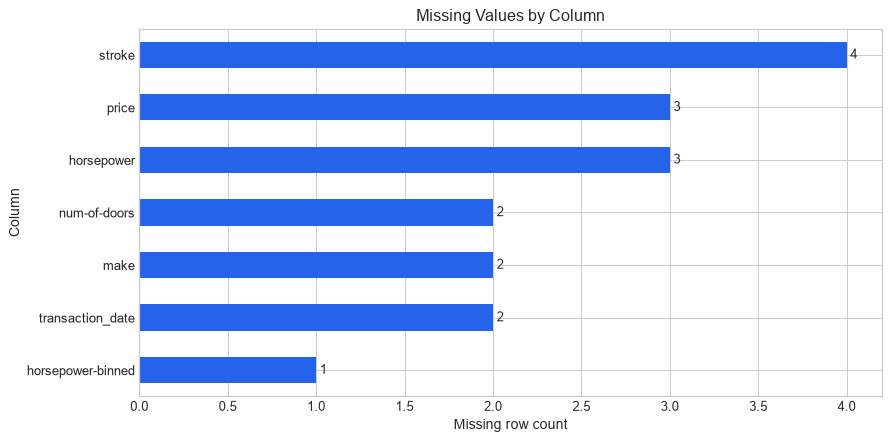
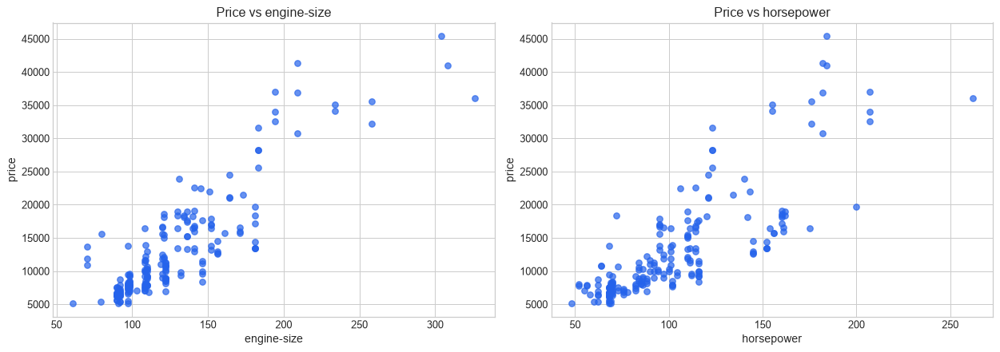
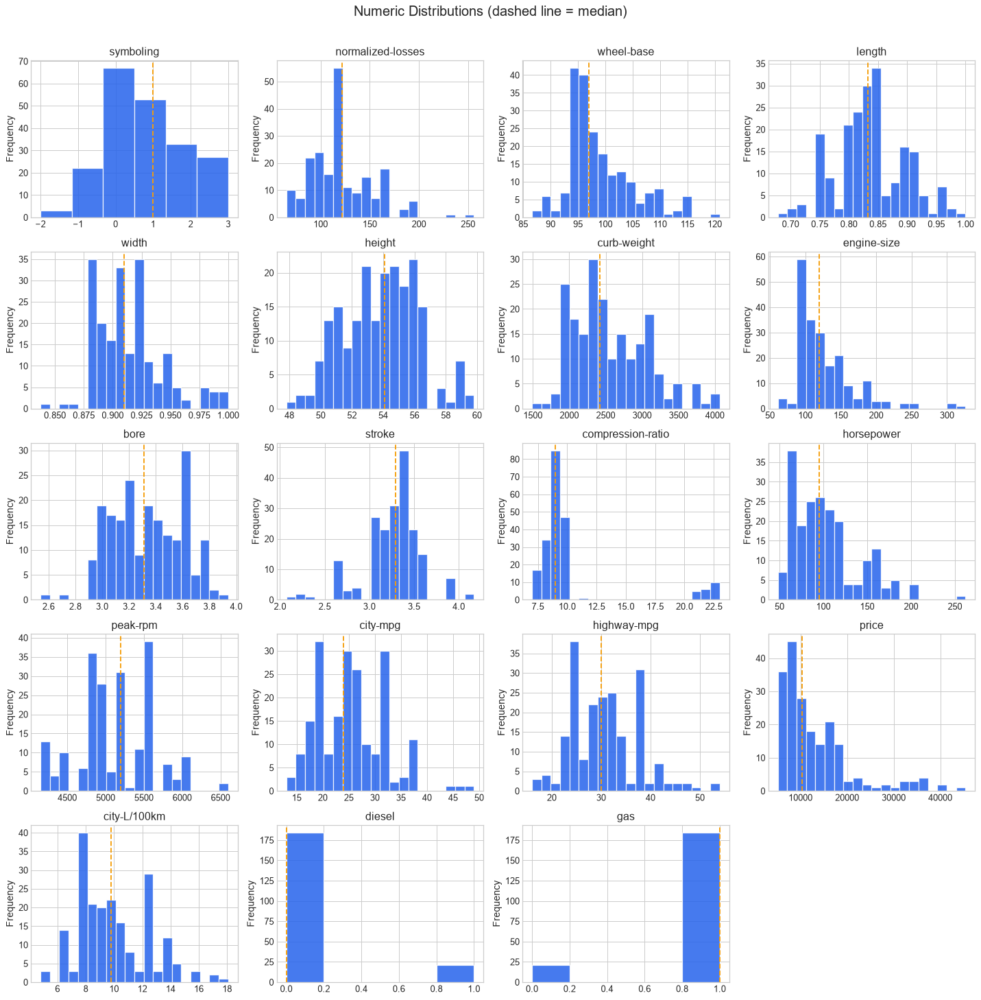
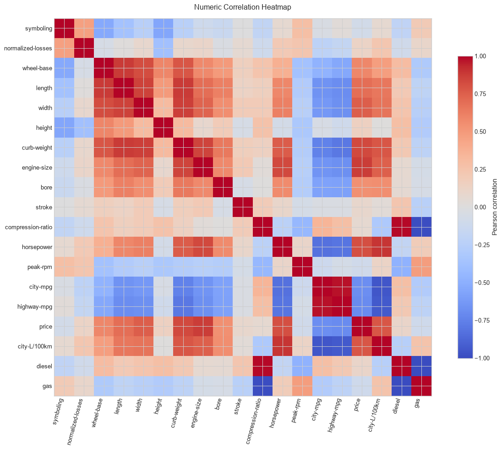

# Data Pipeline Assignment — Muhammad Rabby Ilyas

## Project description

This project prepares the supplied automobile dataset through a reproducible ETL pipeline. The pipeline inspects, cleans, transforms, validates, and saves the data as a new processed CSV without modifying the raw input.

## Dataset

- Source: https://s.id/dataset-sesi-3
- Pipeline input: `data/raw/automobileEDA_dirty_training.csv`
- Processed output: `data/processed/automobileEDA_processed.csv`

## Project structure

```text
assignment-data-pipeline-muhammad-rabby-ilyas/
├── data/
│   ├── raw/
│   │   └── automobileEDA_dirty_training.csv
│   └── processed/
│       └── automobileEDA_processed.csv  # generated by pipeline.py
├── src/
│   ├── pipeline.py
│   └── 01_automobile_data_exploration.ipynb
├── documentation/
│   ├── data-flow-diagram.png
│   ├── missing-values.png
│   ├── numeric-distributions.png
│   ├── correlation-heatmap.png
│   └── price-relationships.png
├── README.md
└── requirements.txt
```

## Initial dataset condition

- Size: 205 rows and 30 columns.
- Missing values: 17 cells across `transaction_date` (2), `make` (2), `num-of-doors` (2), `stroke` (4), `horsepower` (3), `price` (3), and `horsepower-binned` (1).
- Duplicates: 4 exact duplicate copies, leaving 201 unique rows.
- Data types: 21 numeric columns and 9 text-like columns when loaded from CSV; `transaction_date` is initially text and requires explicit parsing.
- Dates: four formats (`YYYY-MM-DD`, `DD/MM/YYYY`, `MM-DD-YYYY`, and `DD-Mon-YYYY`) plus two missing dates.
- Categories: inconsistent capitalization or whitespace in `make`, `body-style`, `drive-wheels`, and `fuel-system`; `AWD` and `4wd` also describe the same drive type.

## Data cleaning

| Problem | Column(s) | Method and reason |
| --- | --- | --- |
| Exact duplicate records | All | Keep the first record and remove 4 repeated copies. |
| Mixed and missing dates | `transaction_date` | Parse each known format explicitly, interpolate the two internal daily gaps, and save as `YYYY-MM-DD`. |
| Inconsistent text | Categorical columns | Trim whitespace and convert labels to lowercase. |
| Equivalent drive labels | `drive-wheels` | Map `AWD` to the existing `4wd` label. |
| Missing categories | `make`, `num-of-doors` | Fill with the column mode. |
| Missing numeric values | `stroke`, `horsepower`, `price` | Fill with the median, which is less sensitive to skew and outliers than the mean. |
| Missing derived category | `horsepower-binned` | Infer the missing band from the existing horsepower boundaries: low through 101, medium through 155, and high above 155. |

Cleaning reduces the dataset from 205 to 201 rows and leaves no missing values or duplicate rows.

## Key exploratory findings

- Automobile prices are right-skewed: the median is 10,270, the mean is 13,165.94, and skewness is 1.832. Expensive vehicles pull the mean upward.
- The strongest positive relationships with price are `engine-size` (0.872), `curb-weight` (0.833), and `horsepower` (0.804).
- Fuel-efficiency measures move in the opposite direction from price: `city-mpg` has a -0.682 correlation and `highway-mpg` has a -0.701 correlation with price.
- Sedan is the most frequent body style with 94 of 201 cleaned records, while gas-powered vehicles account for 181 records.
- After date standardization and missing-date interpolation, transactions cover 2025-01-01 through 2025-07-20.

## Data transformation

| Column | Before | After | Method |
| --- | --- | --- | --- |
| `price` | Example: 13,495 | `price_minmax = 0.207959` | Min-Max scaling preserves the original price while mapping the full 5,118–45,400 range to 0–1. |
| `body-style` | Example: `convertible` | `body_style_convertible = 1`; the other `body_style_*` columns are 0 | One-hot encoding avoids assigning a false order to the five body-style categories. |

The transformation adds `price_minmax` plus `body_style_convertible`, `body_style_hardtop`, `body_style_hatchback`, `body_style_sedan`, and `body_style_wagon`, increasing the dataset from 30 to 35 columns.

## Selected EDA visualizations

These standalone charts are generated by the notebook and remain visible here even if GitHub's notebook preview is temporarily unavailable.

| Missing values in the raw data | Relationships with price |
| --- | --- |
|  |  |
| Numeric distributions | Numeric correlation heatmap |
|  |  |

## ETL flow

1. Extract the raw CSV from `data/raw/`.
2. Print the initial records, shape, columns, data types, missing values, duplicates, and categorical values.
3. Clean the data and print a before/after summary.
4. Transform and validate the data, including concrete transformation examples.
5. Load the result into `data/processed/automobileEDA_processed.csv`.

## Installation

```powershell
python -m venv .venv
.venv\Scripts\Activate.ps1
python -m pip install -r requirements.txt
```

## Running the pipeline

```powershell
python src/pipeline.py
```

The raw dataset must remain unchanged. The processed dataset must be generated automatically by `pipeline.py`.

## Exploratory analysis

Open [`src/01_automobile_data_exploration.ipynb`](src/01_automobile_data_exploration.ipynb) in Jupyter or a notebook-capable editor. Select the project's `.venv\Scripts\python.exe` as the notebook kernel, then run the cells from top to bottom. The committed notebook already contains executed outputs and graphs. It sequentially inspects the raw records, data types, missing values, duplicates, unique values, category consistency, date formats, distributions, and selected relationships without modifying the raw dataset.
